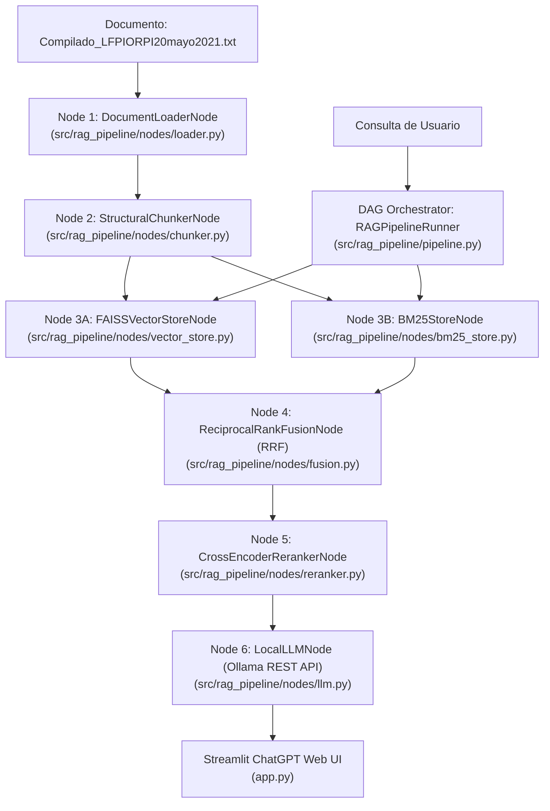

# GRAPH.md: Topología del Grafo de Código RAG (DAG Architecture)

Este documento describe la arquitectura modular basada en un **Grafo Acíclico Dirigido (DAG)** para que cualquier nuevo agente de IA o desarrollador pueda entender, extender o reemplazar nodos de la canalización de forma *Plug & Play*.

---

## 📐 Topología del Grafo de Ejecución

---

## 🛠️ Guía de Nodos para Agentes AI

| ID Nodo | Archivo Fuente | Entrada | Salida | Responsabilidad |
| :--- | :--- | :--- | :--- | :--- |
| **Node 1** | `nodes/loader.py` | Ruta de archivo `.txt` | Texto plano sin cabeceras DOF | Ingesta y filtrado de cabeceras oficiales. |
| **Node 2** | `nodes/chunker.py` | Texto plano | Lista de dicts `chunks` | Splitting estructural por artículos de ley. |
| **Node 3A** | `nodes/vector_store.py` | Chunks | Íntegro FAISS en GPU CUDA | Generación de embeddings densos y Parquet. |
| **Node 3B** | `nodes/bm25_store.py` | Chunks | Índice Okapi BM25 | Tokenización y búsqueda dispersa. |
| **Node 4** | `nodes/fusion.py` | Rankings Densos + Dispersos | Candidatos Top-N RRF | Fusión recíproca de clasificaciones ($k=60$). |
| **Node 5** | `nodes/reranker.py` | Query + Candidatos RRF | Top-K Chunks Reordenados | Cross-Attention scoring sobre GPU. |
| **Node 6** | `nodes/llm.py` | Prompt Inyectado con Fuentes | Texto de Respuesta | Conector cliente REST Ollama `localhost:11434`. |
| **Runner** | `pipeline.py` | Configuración + User Query | Dict `result` completo | Orquestador ejecutor del DAG con toggles. |
| **UI** | `app.py` | Configuración de Toggles & Chat | Renderizado Interactivo | Interfaz gráfica Web Streamlit estilo ChatGPT. |
| **Memory** | `memory.py` | `session_id`, `message` | JSON Persistente | Gestor de múltiples conversaciones. |

---

## 🔌 Cómo Agregar o Reemplazar un Nodo

Para añadir una nueva funcionalidad (ej. un nuevo filtro de moderación o un modelo de embeddings distinto):
1. Crea una clase de nodo en `src/rag_pipeline/nodes/mi_nodo.py` que exponga una función `.run()` o `.process()`.
2. Importa e instancia el nodo dentro de `RAGPipelineRunner` en `src/rag_pipeline/pipeline.py`.
3. Si el nodo requiere un control interactivo en la Web UI, añade la variable de control en el panel lateral de `app.py`.
