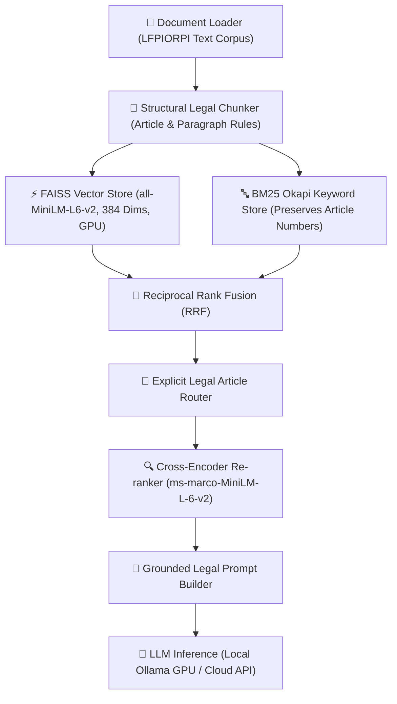

# 🏛️ LFPIORPI Legal RAG Playground & Vector Database Showcase

An interactive, transparent, and modular **Retrieval-Augmented Generation (RAG) Playground** and **Visual Vector Database Showcase** specialized for Mexican Anti-Money Laundering Law (*Ley Federal para la Prevención e Identificación de Operaciones con Recursos de Procedencia Ilícita - LFPIORPI*).

Designed to run **100% locally on GPU** for full privacy and zero API costs, while supporting **Cloud API providers** (OpenAI, Groq) for cloud execution.

---

## 📂 Project Directory Structure

```
bourbaki_rag_trial/
├── app.py                       # Main Streamlit Web Application (RAG Playground & Visual Explorer)
├── tunnel_manager.py            # Remote HTTPS Tunnel Controller (Cloudflare / NGROK)
├── Compilado_LFPIORPI20mayo2021.txt # Source Mexican Anti-Money Laundering Law Text
├── requirements.txt             # Project Python dependencies
├── pyproject.toml               # Project metadata & build settings
├── .env.example                 # Environment variables template for API keys
├── .gitignore                   # Excludes sensitive data, logs, caches & binaries
│
├── notebooks/                   # Research & Empirical Benchmark Jupyter Notebooks
│   ├── reto3_rag_local.ipynb                   # End-to-End Local RAG Implementation
│   ├── reto3_busqueda_hibrida_rerank.ipynb     # Hybrid Search (RRF) & Re-ranking Benchmarks
│   ├── reto3_benchmark_modelos_llm.ipynb       # Empirical Comparison of Local LLMs
│   └── reto3_analisis_preprocesamiento_nlp.ipynb # Corpus Preprocessing & Normalization Analysis
│
├── src/                         # Modular RAG DAG Pipeline Package
│   └── rag_pipeline/
│       ├── config.py            # Global Pipeline Configuration & Absolute Path Resolvers
│       ├── pipeline.py          # DAG Orchestrator Runner
│       ├── memory.py            # Multi-Chat Conversation Memory Manager
│       └── nodes/               # Modular DAG Nodes (Loader, Chunker, FAISS, BM25, RRF, Re-ranker, LLM)
│
├── scripts/                     # Helper Scripts & Automation Utilities
│   ├── build_notebooks/         # Notebook Generation & Execution Utility Scripts
│   └── utils/                   # Database Seeding & Chat Cleanup Utilities
│
└── tests/                       # Automated Test Suite & RPA Playwright Benchmarks
    ├── test_rag_pipeline.py     # RAG Pipeline DAG Unit & End-to-End Tests
    ├── test_rpa_mobile.py       # Mobile Viewport Playwright Responsiveness Test
    └── test_rpa_playwright_full.py # Full RPA User Simulation Test
```

---

## 🌟 Key Features

- **🔬 Real-Time RAG Playground**: Interactively tweak search algorithms (Dense Vector, Sparse Keyword, Hybrid RRF), Re-ranking, Article Router, and text preprocessing on the fly. Inspect cosine similarity scores, BM25 scores, Cross-Encoder attention scores, search latencies, and injected prompts in real time.
- **🗄️ Visual Vector Database Explorer (Showcase)**: Search, filter, sort, and visualize all 137 legal chunks with interactive DataFrames, graphical inspection cards, and corpus analytics bar charts.
- **⚡ Explicit Article Router**: Automatically detects direct article references in user queries (e.g., *"Artículo 17"*, *"Art. 62"*) and boosts them to Position #1.
- **💻 Dual LLM Provider Support**: Runs offline locally with Ollama (GPU-accelerated `qwen2.5:3b`, `llama3.2:3b`, `phi3.5`) or connects to Cloud APIs (`gpt-4o-mini`, `llama-3.3-70b-versatile`) via `.env` or UI settings.
- **📱 Fully Responsive & Mobile-Ready**: Auto-collapsing sidebar for smartphone viewports and built-in remote tunnel controls (Cloudflare / NGROK).

---

## 🏗️ Architecture & Pipeline DAG

The RAG pipeline is orchestrated as a Directed Acyclic Graph (DAG) divided into 7 modular nodes:



1. **Document Loader (`loader.py`)**: Reads raw text from legal decrees and articles.
2. **Structural Legal Chunker (`chunker.py`)**: Segments text into semantically cohesive legal chunks while preserving article identifiers (`Artículo 2`, `Artículo 17`, etc.).
3. **Dense Vector Store (`vector_store.py`)**: Embeds text using `all-MiniLM-L6-v2` (384 dimensions) and builds a FAISS index on GPU (CUDA).
4. **Sparse Keyword Store (`bm25_store.py`)**: Builds a BM25 Okapi index with tokenization that preserves single-digit and multi-digit article numbers (`"2"`, `"17"`, `"62"`).
5. **Hybrid Fusion & Router (`fusion.py` & `pipeline.py`)**: Combines vector cosine similarity and BM25 scores via Reciprocal Rank Fusion (RRF) and boosts explicitly referenced legal articles.
6. **Cross-Encoder Re-ranker (`reranker.py`)**: Passes top candidates through cross-attention scoring to re-order the most relevant chunks.
7. **Grounded Generation (`llm.py`)**: Injects exact legal contexts into the prompt, ensuring responses strictly ground their answers on LFPIORPI law articles.

---

## 📓 Jupyter Notebooks (Stage-by-Stage Breakdown)

This repository includes 4 comprehensive Jupyter Notebooks documenting each research stage:

### 1. `reto3_rag_local.ipynb` — End-to-End Local RAG Implementation
- **Stage**: Pipeline Construction & Verification.
- **Purpose**: Implements the full DAG pipeline from raw document loading to local LLM generation using Ollama on GPU. Verifies grounded answer accuracy.

### 2. `reto3_busqueda_hibrida_rerank.ipynb` — Hybrid Search & Re-ranking Benchmarks
- **Stage**: Information Retrieval Optimization.
- **Purpose**: Evaluates Dense FAISS search vs. Sparse BM25 search vs. Hybrid RRF fusion. Measures precision and mean reciprocal rank (MRR) before and after Cross-Encoder re-ranking.

### 3. `reto3_benchmark_modelos_llm.ipynb` — Empirical LLM Model Comparison
- **Stage**: Model Selection & Performance Evaluation.
- **Purpose**: Compares inference speed (tokens/sec), generation latency, VRAM footprint, and legal grounding across local open-weights models (`qwen2.5:3b`, `llama3.2:3b`, `phi3.5:latest`).

### 4. `reto3_analisis_preprocesamiento_nlp.ipynb` — Legal Corpus Preprocessing Analysis
- **Stage**: Text Normalization & Tokenization.
- **Purpose**: Analyzes the impact of lowercasing, accent stripping, and special character normalization on legal legal terms and numerical article identifiers.

---

## 🚀 Quickstart & Setup Instructions

### Prerequisites
- **Python**: 3.10 or higher.
- **GPU Acceleration (Optional)**: NVIDIA GPU with CUDA for local FAISS and Ollama acceleration.
- **Ollama (Optional for Local Mode)**: Download from [ollama.com](https://ollama.com).

### 1. Clone Repository & Install Dependencies

```bash
git clone https://github.com/Anonymate054/bourbaki_rag_trial.git
cd bourbaki_rag_trial

# Create and activate virtual environment
python -m venv .venv
source .venv/bin/activate  # On Windows: .venv\Scripts\activate

# Install dependencies
pip install -r requirements.txt
```

### 2. Configure Environment Variables (Optional)

Copy `.env.example` to `.env` to configure optional API keys or custom hosts:

```bash
cp .env.example .env
```

If you wish to use OpenAI or Groq instead of local Ollama, add your key to `.env`:

```env
OPENAI_API_KEY=sk-your-openai-key-here
GROQ_API_KEY=gsk_your-groq-key-here
```

### 3. Start Local LLM Server (Ollama)

```bash
# Start Ollama daemon
ollama serve

# Pull local model weights (1.9 GB)
ollama pull qwen2.5:3b
```

### 4. Run Interactive Web Portal (Streamlit)

```bash
streamlit run app.py
```

Open your browser at **`http://localhost:8501`**.

---

## 🖥️ Web Portal Features

### Tab 1: 💬 RAG Playground & Chatbot
- **Interactive Sidebar Controls**: Toggle Search Algorithm (Hybrid, Dense, Sparse), Re-ranking ON/OFF, Article Router ON/OFF, Preprocessing Mode (Raw vs Clean), and Top-K slider.
- **LLM Provider Selector**: Switch between Local GPU (Ollama) or Cloud API (OpenAI/Groq).
- **🔬 Inspector RAG Playground**: Expandable diagnostic panel showing search latency, generation time, chunk score comparison tables (Cosine Sim, BM25, Cross-Encoder, Router Boost), and raw injected prompts.

### Tab 2: 🗄️ Visual Vector Database Explorer
- **KPI Metrics**: Total indexed chunks, vector dimensions (384), CUDA GPU status, total character counts.
- **Dynamic Search & Filtering**: Keyword search, article multiselect, character length range slider, dynamic column sorting.
- **Visual Chunk Cards & Analytics**: Render chunks as graphic cards and view character/article distribution bar charts.

---

## 🔒 Security & Privacy Safeguards

This repository strictly enforces security standards:
- **No Hardcoded Credentials**: API keys are loaded via `.env` or input fields in session memory.
- **Filtered Artifacts**: `.gitignore` excludes local environments (`.venv/`), temporary logs (`*.log`), session histories (`chat_sessions/`), local database caches, and executable binaries (`*.exe`).

---

## 📜 License

Distributed under the MIT License. See `LICENSE` for details.
